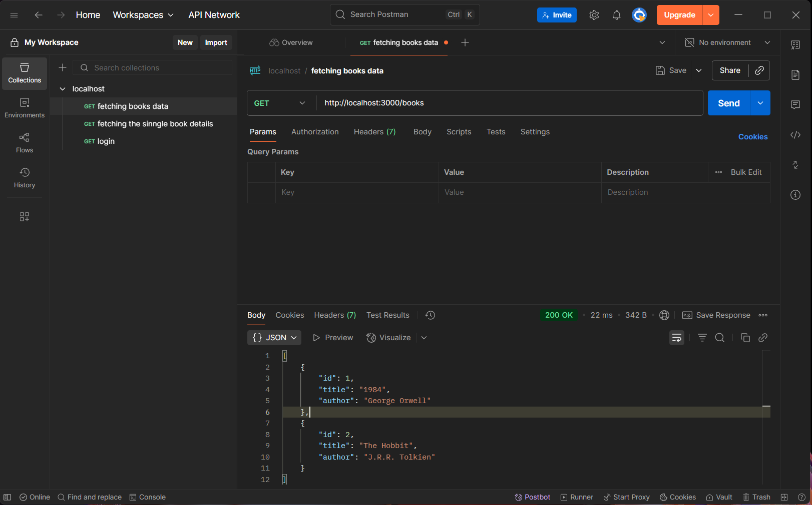
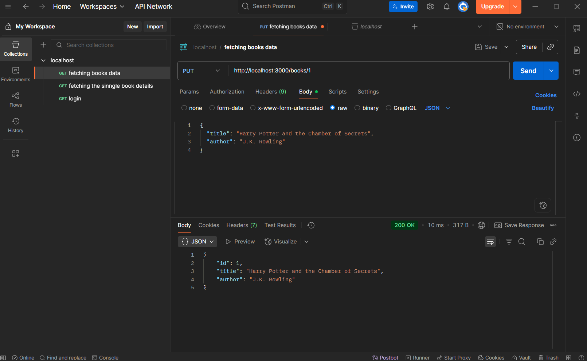
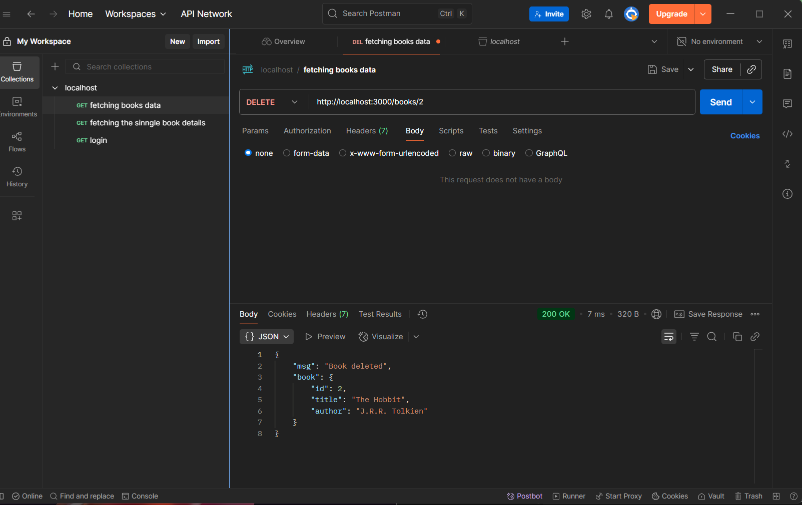

#  Book API with Express.js

A simple RESTful API built with Express.js to manage a list of books.

---

##  Features

- `GET /books`: List all books
- `POST /books`: Add a new book
- `PUT /books/:id`: Update an existing book
- `DELETE /books/:id`: Delete a book by ID

---

##  Testing Endpoints

-  **GET /books**: 
-  **POST /books**: 
-  **PUT /books/:id**: 
-  **DELETE /books/:id**: 

### Example: Add a Book (POST /books)

```json
{
  "title": "Harry Potter and the Chamber of Secrets",
  "author": "J.K. Rowling"
}